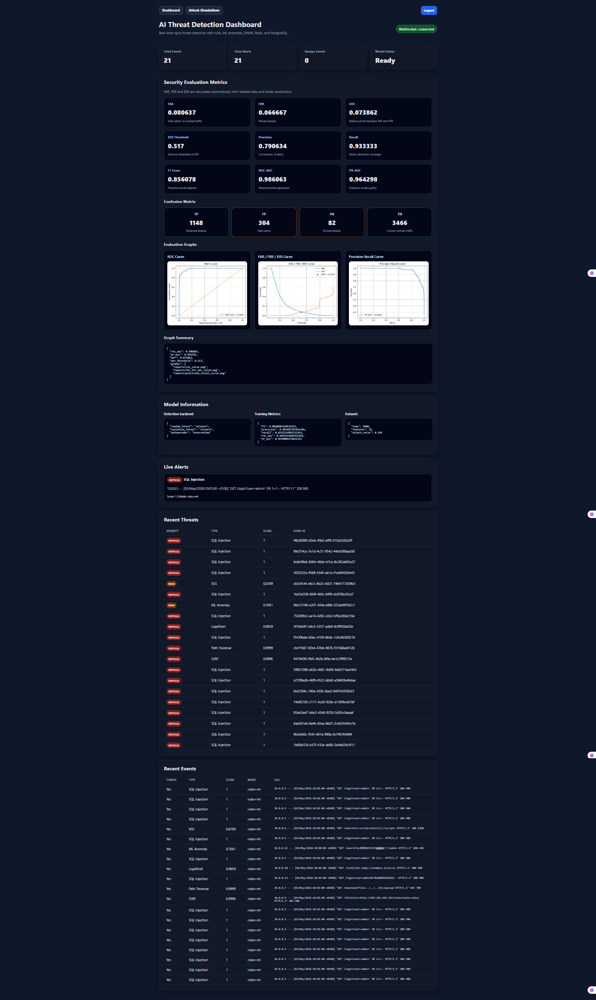
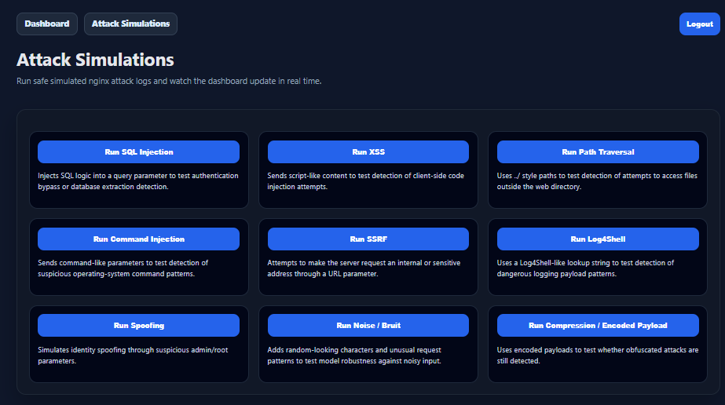
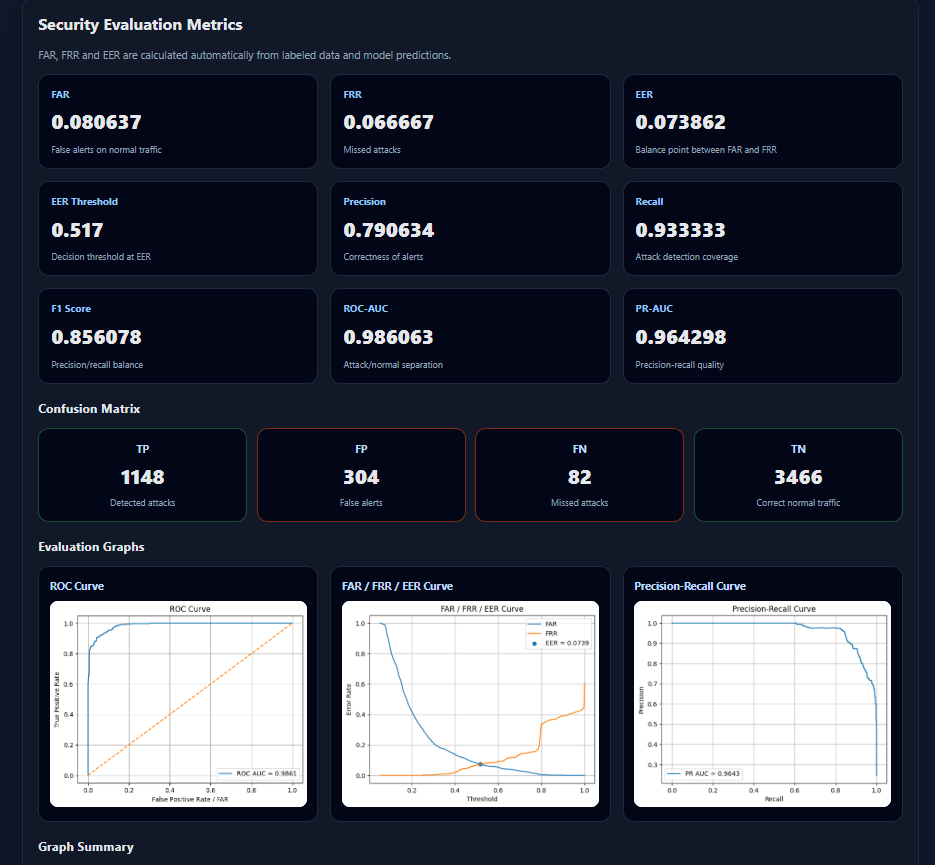

# AI Threat Detection Platform

A real-time web threat detection platform that analyzes nginx access logs and detects malicious HTTP behavior using a hybrid detection engine combining rules, machine learning, anomaly detection, and live alerting.

This project simulates a lightweight SOC/SIEM-style system for web application security monitoring.

---

## Why this project

Most cybersecurity ML projects stop at offline model training.

This project goes further by building a complete end-to-end system:

- real-time log analysis
- hybrid detection engine
- attack simulation interface
- live WebSocket alerts
- persistent event storage
- security evaluation metrics
- visual performance graphs
- JWT-protected dashboard
- Dockerized full-stack deployment

The goal is not only to detect attacks, but also to prove how well the system performs.

---

## What is being protected?

The system is designed to protect web applications and APIs exposed over HTTP.

It monitors nginx access logs, which represent incoming traffic to a backend application such as Flask, Django, Node.js, PHP, or any API service.

Protection model:

User / Attacker -> HTTP Request -> nginx -> Detection System -> Application

The detector does not replace nginx. It analyzes nginx logs to detect attacks targeting the application behind it.

---

## Features

### Detection

- Real-time nginx-style log analysis
- Rule-based attack detection
- Machine learning classification
- Anomaly detection
- ONNX Runtime inference
- Threat scoring and severity classification

### Supported attack simulations

- SQL Injection
- Cross-Site Scripting
- Path Traversal
- Command Injection
- SSRF
- Log4Shell
- Spoofing-like behavior
- Noisy payloads
- Encoded / obfuscated payloads

### Dashboard

- JWT login
- Live WebSocket alerts
- Recent threats
- Recent events
- Model status
- Security evaluation metrics
- Confusion matrix
- ROC, Precision-Recall, and FAR/FRR/EER graphs
- Separate attack simulation page

### Infrastructure

- FastAPI backend
- React frontend
- PostgreSQL database
- Redis pub/sub
- Docker Compose
- nginx frontend serving
- API key support
- JWT authentication

---

## Detection Engine

The detection engine uses a hybrid approach.

### Rule-based detection

Rules detect known attack patterns such as:

- SQL keywords
- script tags
- path traversal patterns
- SSRF indicators
- Log4Shell payloads
- suspicious command patterns

### Machine learning models

The ML layer combines:

- Random Forest for supervised classification
- Isolation Forest for anomaly detection
- Autoencoder for reconstruction-based anomaly scoring
- ONNX Runtime for portable inference

Each HTTP request is transformed into numerical features before detection.

Examples of extracted features:

- path length
- number of digits
- number of special characters
- query length
- HTTP status code
- response size
- path entropy
- SQL keyword presence
- script tag presence
- SSRF indicator
- Log4Shell indicator

---

## Security Evaluation

The system evaluates itself using labeled data and real model predictions.

Metrics are computed automatically from the confusion matrix:

- TP: correctly detected attacks
- TN: correctly detected normal requests
- FP: false alerts
- FN: missed attacks

Current evaluation metrics:

- FAR: False Acceptance Rate
- FRR: False Rejection Rate
- EER: Equal Error Rate
- Precision
- Recall
- F1-score
- ROC-AUC
- PR-AUC

The dashboard also displays generated graphs:

- ROC Curve
- Precision-Recall Curve
- FAR / FRR / EER Curve

These values are not hardcoded. They are calculated from model predictions on labeled data.

---

## Architecture

nginx access logs  
-> parser  
-> feature extraction  
-> rules + ML ensemble  
-> PostgreSQL + Redis  
-> FastAPI backend  
-> WebSocket  
-> React dashboard  

---

## Screenshots

Create the following screenshots after running the project:

- `screenshots/dashboard.png`
- `screenshots/attacks.png`
- `screenshots/metrics.png`

Then uncomment or update these lines:

Dashboard:

Attack simulation page:

Security metrics and graphs:

---

## Tech Stack

Backend:

- Python
- FastAPI
- scikit-learn
- ONNX Runtime
- PostgreSQL
- Redis

Frontend:

- React
- Vite
- nginx

Infrastructure:

- Docker
- Docker Compose

---

## Authentication

The platform includes:

- JWT login authentication
- API key support for service-level access

Default demo credentials:

Username: iheb  
Password: iheb  

After login, the dashboard uses a JWT token to access protected backend endpoints.

---

## Running the Project

Start the full stack:

`docker compose up --build`

Open the dashboard:

http://127.0.0.1:3000

Open the attack simulation page:

http://127.0.0.1:3000/attacks

Backend API:

http://127.0.0.1:8000

---

## Demo Workflow

1. Start the Docker stack.
2. Open the dashboard.
3. Login with the default credentials.
4. Open the attack simulation page.
5. Trigger an attack.
6. Watch the dashboard update in real time.
7. Review alerts, scores, metrics, confusion matrix, and evaluation graphs.

---

## Useful API Endpoints

Health check:

`GET /health`

Analyze a log:

`POST /analyze`

Statistics:

`GET /stats`

Recent events:

`GET /events`

Recent threats:

`GET /threats`

Model status:

`GET /models/status`

Security metrics:

`GET /models/security-metrics`

Metrics graph summary:

`GET /models/metrics-graphs`

Live alerts:

`WebSocket /ws/alerts`

---

## Project Highlights

This project demonstrates:

- real-time security monitoring
- full-stack system design
- practical ML integration
- anomaly detection
- model evaluation
- live alerting
- API authentication
- Dockerized deployment
- dashboard visualization

---

## Future Improvements

- Replace synthetic fallback data with larger real-world nginx datasets
- Add user roles and RBAC
- Add alert notifications through Slack, Discord, or email
- Add Prometheus and Grafana dashboards
- Add Kafka for scalable streaming
- Add Kubernetes deployment
- Add CI/CD deployment pipeline
- Add multi-tenant monitoring support

---

## Author

Iheb Mrabet

---

## Note

This project is a realistic simulation environment for learning, demonstration, and portfolio purposes. It can be extended to monitor real nginx logs from production applications.
